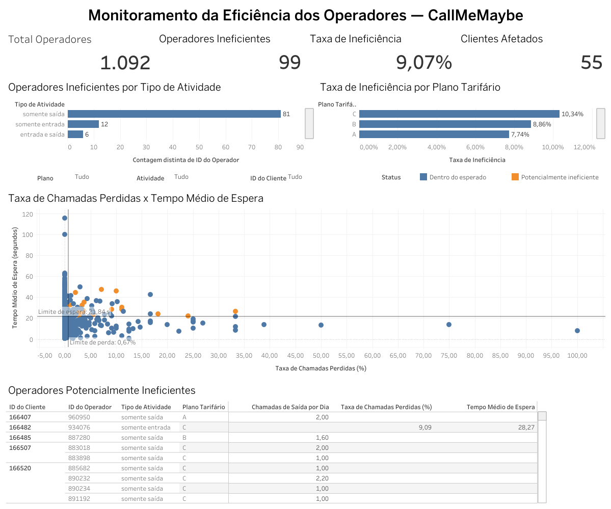

# CallMeMaybe — Análise de Eficiência dos Operadores

Projeto de análise de dados desenvolvido para avaliar o desempenho dos operadores de uma central de atendimento e identificar possíveis sinais de ineficiência operacional.

A análise foi realizada em Python e complementada com testes estatísticos e um dashboard interativo desenvolvido no Tableau Public.

## Dashboard



### 🔗 Dashboard interativo

[Visualizar dashboard no Tableau Public](https://public.tableau.com/app/profile/giovani.vitor/viz/MonitoramentodaEficinciadosOperadores-CallMeMaybe/Dashboard-EficinciadosOperadores?publish=yes)

---

## Objetivo do projeto

O objetivo deste projeto foi avaliar a eficiência dos operadores da CallMeMaybe e identificar profissionais que poderiam necessitar de acompanhamento.

Foram analisados três indicadores principais:

- taxa de chamadas recebidas perdidas;
- tempo médio de espera;
- volume médio diário de chamadas de saída.

A análise também buscou identificar clientes e planos tarifários com maior concentração de operadores potencialmente ineficientes.

---

## Principais indicadores

| Indicador | Resultado |
|---|---:|
| Operadores analisados | 1.092 |
| Operadores potencialmente ineficientes | 99 |
| Taxa de operadores potencialmente ineficientes | 9,07% |
| Clientes analisados | 290 |
| Clientes com pelo menos um operador ineficiente | 55 |
| Clientes afetados | 18,97% |
| Plano com maior proporção de ineficiência | Plano C — 10,34% |

---

## Critérios de identificação

Os limites foram definidos com base na distribuição dos próprios dados, utilizando quartis como referência.

| Indicador | Critério |
|---|---:|
| Taxa de chamadas recebidas perdidas | acima de 0,67% |
| Tempo médio de espera | acima de 21,84 segundos |
| Média diária de chamadas de saída | abaixo de 2,67 chamadas |

A classificação também considerou o tipo de atividade de cada operador, evitando comparar profissionais com responsabilidades diferentes.

---

## Principais resultados

Foram identificados **99 operadores potencialmente ineficientes**, correspondendo a **9,07% dos 1.092 operadores analisados**.

A maior concentração ocorreu entre operadores que realizavam somente chamadas de saída.

Entre os planos tarifários, o **Plano C apresentou a maior proporção de operadores potencialmente ineficientes, com 10,34%**.

Além disso, **55 dos 290 clientes analisados** possuem pelo menos um operador classificado como potencialmente ineficiente, representando **18,97% dos clientes**.

Os resultados permitem direcionar o acompanhamento para operadores e clientes específicos, evitando ações generalizadas.

---

## Testes estatísticos

Foram realizados testes de hipóteses para avaliar diferenças entre os grupos analisados.

### Chamadas perdidas — internas x externas

Foi aplicado o **teste qui-quadrado de independência**.

O resultado indicou associação estatisticamente significativa entre o tipo da chamada recebida e a ocorrência de chamadas perdidas.

### Tempo de espera — internas x externas

Como os dados não apresentaram distribuição normal, foi utilizado o **teste de Mann-Whitney U**.

O resultado indicou diferença estatisticamente significativa entre os tempos de espera de chamadas internas e externas.

### Volume de chamadas de saída

Também foi utilizado o **teste de Mann-Whitney U** para comparar operadores que realizavam somente chamadas de saída com operadores que realizavam chamadas de entrada e saída.

O teste indicou diferença estatisticamente significativa entre os dois perfis.

---

## Recomendações

Com base nos resultados da análise:

- priorizar o acompanhamento dos operadores identificados como potencialmente ineficientes;
- analisar separadamente operadores de entrada, saída e atividade mista;
- monitorar continuamente a taxa de chamadas perdidas e o tempo de espera;
- utilizar a média de chamadas por dia ativo para avaliar operadores de saída;
- investigar clientes com maior concentração de operadores com sinais de ineficiência;
- utilizar o dashboard como ferramenta de apoio ao monitoramento operacional.

Os indicadores devem ser utilizados como **sinais de alerta para investigação**, e não como uma classificação automática de desempenho.

---

## Tecnologias utilizadas

- Python
- Pandas
- NumPy
- Matplotlib
- Seaborn
- SciPy
- Jupyter Notebook
- Tableau Public
- Git / GitHub

---

## Etapas da análise

1. Carregamento e diagnóstico inicial dos dados
2. Limpeza e preparação dos dados
3. Tratamento de valores ausentes e duplicados
4. Construção das métricas de eficiência
5. Análise exploratória dos operadores
6. Definição dos critérios de ineficiência
7. Testes estatísticos
8. Análise por cliente e plano tarifário
9. Desenvolvimento do dashboard no Tableau

---

## Notebook

O notebook contém todo o processo de preparação, análise exploratória, construção das métricas, testes estatísticos e conclusões do projeto.

[📓 Acessar o notebook do projeto](callmemaybe_analysis_portfolio.ipynb)

---

## Estrutura do repositório

```text
callmemaybe-operator-efficiency/
│
├── README.md
├── callmemaybe_analysis_portfolio.ipynb
│
└── dashboard/
    ├── dashboard_callmemaybe.png
    └── tableau_link.txt
